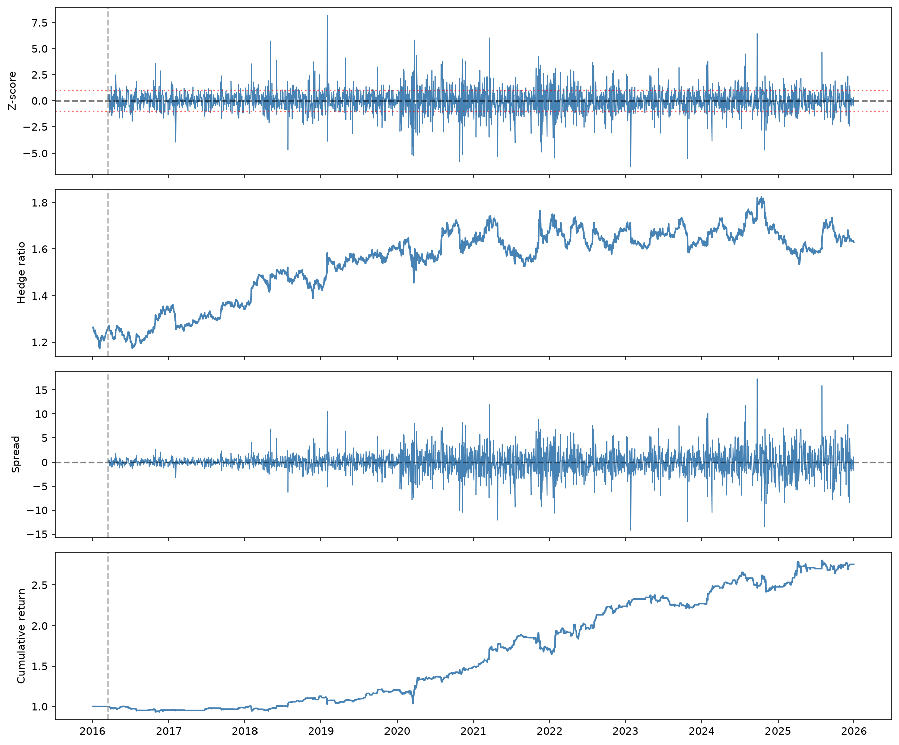

# Kalman-Filtered Pairs Trading

A mean-reversion pairs-trading strategy on two cointegrated equities, 
from statistical tests to a backtest with realistic transaction costs.

## The Idea

Most individual price series are not mean-reverting — they behave like 
random walks. But a linear combination of two related assets can be 
stationary even when each asset alone is not. That combination is called 
a **cointegrating relationship**, and trading its spread is the basis of 
pairs trading.

This project builds a complete pipeline: cointegration testing, dynamic 
hedge-ratio estimation via the Kalman filter, Bollinger-band signals, 
and a backtest with transaction costs.

## The Pair

**Mastercard (MA) and Visa (V)** — two large-cap payment networks with 
similar business models and highly correlated returns. We tested the 
framework on several candidate pairs and found that MA/V was uniquely 
well-suited: the pair is cointegrated at 99% confidence (Engle-Granger 
p = 0.001), the Johansen test finds exactly one cointegrating 
relationship, and the resulting spread has a tradeable half-life of 
~36 days.

## Method

1. **Cointegration test.** The Engle-Granger (CADF) test rejects the 
   null of no cointegration at 99% confidence. The Johansen test 
   confirms one cointegrating relationship.
2. **Dynamic hedge ratio.** A Kalman filter estimates the time-varying 
   hedge ratio β(t) and intercept μ(t), producing a stationary spread 
   ε(t) = MA(t) − β(t)·V(t) − μ(t).
3. **Signals.** Bollinger bands on the z-score of ε(t). Enter when 
   |z| > 1.0, exit when z crosses 0.
4. **Backtest.** Daily mark-to-market with 2 bps per leg per trade.

## Results (2016–2025, TC = 2 bps)

| Metric | Value |
|---|---|
| APR | 10.69% |
| Annual Vol | 12.17% |
| Sharpe | 0.88 |
| Max Drawdown | −14.86% |
| Total Return | 175.49% |
| Trades | 870 |



*Top to bottom: z-score with entry/exit bands; time-varying hedge ratio; 
spread; cumulative return.*

## Cost Sensitivity

| TC (bps) | Net Return | Sharpe |
|---|---|---|
| 0 | 289.71% | 1.19 |
| 1 | 227.67% | 1.03 |
| 2 | 175.49% | 0.88 |
| 5 | 63.70% | 0.42 |
| 10 | −31.30% | −0.31 |

The strategy is profitable at retail-sized costs (1–2 bps per leg), 
marginal at institutional costs (5 bps), and unprofitable at very high 
costs (10 bps).

## Files

- `notebooks/exploration.ipynb` — cointegration analysis (ADF, CADF, Johansen)
- `kalman_strategy.py` — Kalman filter, signals, and backtest
- `figures/kalman_panels.png` — diagnostic chart

## Reproducing
```bash
pip install -r requirements.txt
python kalman_strategy.py
```

Price data is cached in `data/`. To regenerate, uncomment the `yf.download` lines in `exploration.ipynb` or `kalman_strategy.py`.

## Discussion

**The hedge ratio is genuinely dynamic.** β rises from ~1.2 in 2016 to 
~1.8 by 2024, reflecting structural drift in the MA/V relationship. A 
static OLS hedge ratio would be badly mis-hedged by the end of the 
sample; the Kalman filter tracks this drift.

**Returns are concentrated post-2020.** The strategy made almost no 
money in 2016–2019. During that period the hedge ratio was still 
drifting, and the filter spent most of its time adapting. After 2020, 
the relationship stabilized and the strategy began to work.

**The z-score has heavier tails than Gaussian.** Values occasionally 
exceed ±5, reflecting non-Gaussian spread shocks. The filter's Gaussian 
assumption is an approximation but remains useful in practice.

## Future Work

- **Walk-forward validation.** Re-tune δ and entry/exit thresholds on a 
  rolling window and evaluate out-of-sample.
- **Rolling OLS comparison.** Benchmark the Kalman filter against a 
  simpler rolling-OLS hedge ratio.
- **Additional pairs.** Test the framework on other cointegrated pairs 
  in different sectors (energy, banks, commodities).

## References

- Chan, E. P. (2013). *Algorithmic Trading: Winning Strategies and 
  Their Rationale.* Wiley.
- Johansen, S. (1991). Estimation and hypothesis testing of 
  cointegration vectors in Gaussian vector autoregressive models. 
  *Econometrica*, 59(6), 1551–1580.
